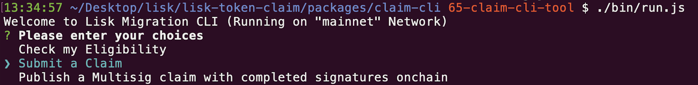
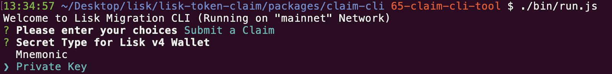
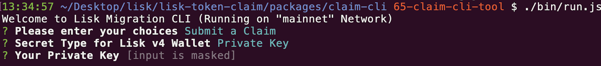
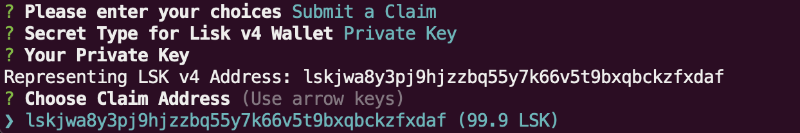
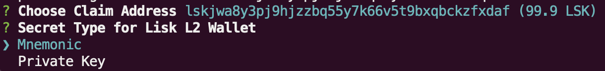
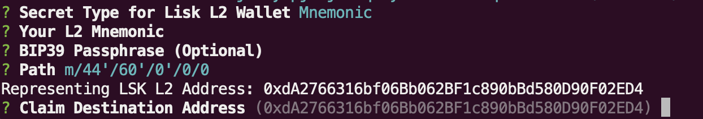
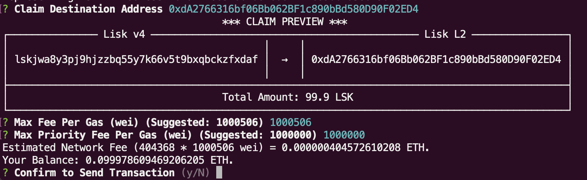
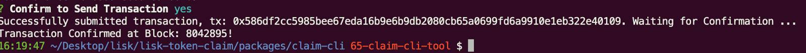

# Detailed Guide to Claim CLI Tool

1. Follow [Run](../packages/claim-cli/README.md) in Claim CLI Readme to start Claim CLI
2. Select `Submit a Claim`  
   
3. Select `Private Key` or `Mnemonic` as Type for Lisk v4 Wallet.  
   
4. Paste `Private Key` or `Mnemonic` from Lisk Desktop or other Wallet App (e.g. Exodus).  
   
5. Select the LSK Account you wanted to claim.  
   
6. Choose and enter mnemonic or private key for Lisk L2.  
   
7. If data is inputted correctly, the CLI will show Lisk L2 address, which can also be the destination address of the Claim.  
   
8. Verify details and network fee before submitting the transaction. Network fee can be adjusted or using the amount suggested by the network.  
   
9. Success, the transaction can be viewed on explorer by using the transaction hash.  
   
