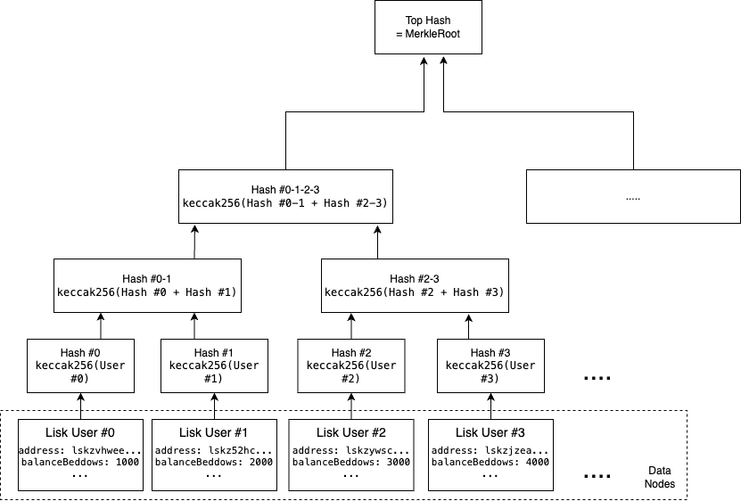

# Tech Design <!-- omit in toc -->

## Table of Contents <!-- omit in toc -->

- [Background](#background)
- [Requirement](#requirement)
- [Component](#component)
  - [Lisk-db](#lisk-db)
  - [Lisk-token-claim](#lisk-token-claim)
    - [Lisk-tree-builder](#lisk-tree-builder)
    - [Lisk-claim-backend](#lisk-claim-backend)
  - [Lisk L2 Claim Contract](#lisk-l2-claim-contract)
  - [Lisk-token](#lisk-token)
  - [Lisk-portal](#lisk-portal)
- [Specification](#specification)
  - [Lisk-tree-builder](#lisk-tree-builder-1)
  - [Lisk-claim-backend:Endpoint](#lisk-claim-backendendpoint)
    - [POST `/checkEligibility`](#post-checkeligibility)
      - [Request](#request)
      - [Response](#response)
    - [POST `/submitMultisig`](#post-submitmultisig)
      - [Request](#request-1)
      - [Response](#response-1)
  - [Lisk-claim-backend:DB Schema](#lisk-claim-backenddb-schema)
- [Design](#design)
  - [Prepare Stage](#prepare-stage-in-blue)
  - [Claim Stage](#claim-stage-in-red)
    - [Regular Account](#regular-account)
    - [Multisig Account](#multisig-account)
  - [Completion Stage](#completion-stage-in-green)
- [Visual Graph of Claim Process](#visual-graph-of-claim-process)

## Background

To migrate from Lisk Mainchain (Lisk Chain) to LSK L2 Network (L2 Chain). A token claim process is needed to transfer users’ valuable token to the new network.

## Requirement

Token Claim could:

- Let user claim LSK token at L2 Chain
- Validate proof-of-existence by accepting proof from user
- Identify holder at Lisk Chain at L2 Chain by verifying ED25519 signature
- Prevent imposter front-running others’ claim
- Recover unclaimed LSK after 2 Years to DAO address

## Component

### [Lisk-db](https://github.com/LiskHQ/lisk-sdk)

Stores all user balance at Lisk Chain. To be used here to generate snapshot for later stage

### [Lisk-token-claim](https://github.com/LiskHQ/lisk-token-claim)

A monorepo that stores 2 components, lisk-tree-builder and lisk-claim-backend:

#### [Lisk-tree-builder](https://github.com/LiskHQ/lisk-token-claim/tree/main/packages/tree-builder)

A script to generate Merkle Tree during the claim preparation process. It will read db directly to get address balances and multisig information. The result will be passed to Lisk-claim-backend.

#### [Lisk-claim-backend](https://github.com/LiskHQ/lisk-token-claim/tree/main/packages/claim-backend)

A Server for users to check eligibility, and retrieve required information for the claim. Such as proof. The backend also stores signatures of multisig account, such that users could gather signatures from the backend, without sending JSON files between signers.

### [Lisk L2 Claim Contract](https://github.com/LiskHQ/lisk-contracts/blob/main/src/L2/L2Claim.sol)

The main Claim Contract that users interact with.

### [Lisk-token](https://github.com/LiskHQ/lisk-contracts/blob/main/src/L2/L2LiskToken.sol)

Newly deployed LSK Token contract at L2, the token to be claimed in this process.

### [Lisk-portal](https://github.com/LiskHQ/lisk-portal)

The platform user interacts with, including the Server, Walletconnect and Metamask extensions.

## Specification

### Lisk-tree-builder

It is the main service to build Merkle Tree with Merkle Root.
Merkle Tree can be generated by the following command

```
$ ./lisk-tree-builder generate-merkle-tree --dbPath=/User/.lisk/lisk-core/data/
```

The above path should contain blockchain data, namely `state.db`
Each Merkle Leaf consist of the following detail of each user.

```
LSK_ADDRESS_IN_HEX: bytes20
BALANCE_IN_BEDDOWS: uint64
NUMBER_OF_SIGNATURES: uint32
MANDATORY_KEYS: bytes32[]
OPTIONAL_KEYS: bytes32[]
```

After sorting user by address, all users will be placed at the bottom of the tree node (leaf). They would then be hashed and paired up, concatenate and become another hash.  
After several operations, there will be 1 top hash left, this hash would be the **MerkleRoot**. For each leaf, the hashes along its way up to the root, are **MerkleProof**.



Lisk-tree-builder uses [Openzeppelin’s MerkleTree library](https://github.com/OpenZeppelin/merkle-tree) to achieve tree generation mentioned above. After generation of the tree. A JSON file will be output to store the tree for further operation.

After running tree-builder, 3 files will be generated.

|                    | merkle-root.json (For Claim Contract deployment) | merkle-tree-result.json (For testing purpose) | merkle-tree-result-detailed.json (For publication to website) |
| ------------------ | ------------------------------------------------ | --------------------------------------------- | ------------------------------------------------------------- |
| merkleRoot         | ✅                                               | ✅                                            | ✅                                                            |
| leaves             |                                                  |                                               |                                                               |
| lskAddress         | ❌                                               | ❌                                            | ✅                                                            |
| b32Address         | ❌                                               | ✅                                            | ✅ (as address)                                               |
| balanceBeddows     | ❌                                               | ✅                                            | ✅                                                            |
| numberOfSignatures | ❌                                               | ✅                                            | ✅                                                            |
| mandatoryKeys      | ❌                                               | ✅                                            | ✅                                                            |
| optionalKeys       | ❌                                               | ✅                                            | ✅                                                            |
| hash               | ❌                                               | ❌                                            | ✅                                                            |
| proof              | ❌                                               | ✅                                            | ✅                                                            |

### Lisk-claim-backend:Endpoint

After the MerkleTree data is created by Lisk-tree-builder, the result will be stored as JSON. Lisk-claim-backend would then read the JSON during startup.

Lisk-claim-backend will be hosted at Digitalocean, since the request is requested statelessly, load-balancing mechanism could be used, when high-traffic immense, extra server could be added so that no downtime is needed during scaling.

Backend will be using JSON RPC 2.0 Standard. Currently the backend has 2 method. Sharing the common endpoint:

> [!NOTE]
> In JSON RPC 2.0, error triggered from method itself, would still respond with 200. i.e. All responses below are 200 Response.

```
<<server>>/rpc
```

#### POST `/checkEligibility`

It accepts POST request with param `lskAddress`. If the address has eligible LSK to claim, it will return amount of token (`account`), proof and, should this `address` owns any multisig account, it will also be displayed here (`multisigAccounts`).

For multisig addresses, there is a `ready` flag to determine if the claim is ready.

`signatures` stores signatures that are related to accounts in `multisigAccounts`, and `account` if that is also a multisig address

##### Request

```
{
    "jsonrpc": "2.0",
    "method": "checkEligibility",
    "params": {
        "lskAddress": "lskfcu7z7sch46o67sq24v9h9df2h5o2juvjp3fjj"
    },
    "id": 1
}
```

##### Response

<details>
  <summary>OK (Address is regular account, has eligible LSK to claim, and is not a member of any multisig account)</summary>

```
    {
        "jsonrpc": "2.0",
        "id": 1,
        "result": {
            "account": {
                "lskAddress": "lskfcu7z7sch46o67sq24v9h9df2h5o2juvjp3fjj",
                "address": "0xf0e0e03b63ea54c53b75c244deb75ec756cc7202",
                "balanceBeddows": "865518296094",
                "numberOfSignatures": 0,
                "mandatoryKeys": [],
                "optionalKeys": [],
                "hash": "0xcf56d515e14469654f651b1433d7ad8ad6590dbe596c6a206c42e5bb8ca4adbc",
                "proof": [
                    "0xd033adcd94586212816701172d897c4c7cbd9be9bbaa503d92065e4b3c5b2530",
                    "0x6d96f4064bfc717721e8e890f38d2b66a05ae3a82e8f0bf671ef6dda4b2b50fd",
                    "0x61cd10db4642b211ee32a574c1e48928eb63411d3827bbbda578d80b79782454",
                    "0xa7afb573620be2a708796b5d2bdcf1c7f582fb4af6e94189b8b494ff0fc97f6a",
                    "0x50cddb7c845bf4bac6b2dc0567ad24e3bcb211807653ded0494aa0db89129371",
                    "0x743659f8f5bdbf49a0b5f65b6877a394cae4bd047b973ed03d9a85ab2af3421f"
                ]
            },
            "multisigAccounts": [],
            "signatures": []
        }
    }
```

</details>
<details>
  <summary>OK (Address is a multisig account, has eligible LSK to claim, and is not a member of any multisig account, including itself)</summary>

```
{
  "account": {
    "lskAddress": "lskf9t4eho3cayhhp7k5rruu4g7gr8yzo9b6yg4s4",
    "address": "0xf3669b75881e63de91d45ca50827eefc9f1031a6",
    "balanceBeddows": "551573764672",
    "numberOfSignatures": 2,
    "mandatoryKeys": [
      "0x83eac294606806e0f4125203e2d0dac5ef1fc8730d5ec12e77e94f823f2262fa"
    ],
    "optionalKeys": [
      "0xc75fd8d6cdb26f53f1fc9d16b5361099ae73907dfbfba112c6dcc94b5afbb600",
      "0x0824f95c67a1bf7726a928db60d9966ad644d3a50f135d8c2bc7862cf08ea5b1"
    ],
    "hash": "0x99ceb57a2b44f7788e14f147f6bce45b4b59ac778467e4234a090289e4e1be95",
    "proof": [
      "0x992fae426541ebc572b3ece341c0c91ec9f2cb5e84da42e984a4b4cff6a79582",
      "0xb62e06184adf8cd8c77efc0b59a70b07119420b1983c520922310b5025f3a577",
      "0x31778e330a6170e7219906a678fffada94359e252e8333b8156f8ba24dcc00a6",
      "0xe7ef1afc74c540d7f5b0de144df97567682b23f248c72c18b100f61f1d76c677",
      "0x51db133405b8a8965573896ba94575e8dba883075c7b20fad2b89dda200a0ec5",
      "0xdd50eede5efdffa8505ec6c9d39734b0d651c10e7986718f2b992d6f3cc610b0",
      "0x94f518fc2f5364d69469f7b4a6e8c73321d0252459fae9be85be6faad06e421b"
    ],
    "ready": false
  },
  "multisigAccounts": [],
  "signatures": []
}
```

</details>
<details>
  <summary>OK (Address is a multisig account, has eligible LSK to claim, and the address is a member of itself)</summary>

```
{
  "account": {
    "lskAddress": "lskf9t4eho3cayhhp7k5rruu4g7gr8yzo9b6yg4s4",
    "address": "0xf3669b75881e63de91d45ca50827eefc9f1031a6",
    "balanceBeddows": "551573764672",
    "numberOfSignatures": 2,
    "mandatoryKeys": [
      "0x83eac294606806e0f4125203e2d0dac5ef1fc8730d5ec12e77e94f823f2262fa"
    ],
    "optionalKeys": [
      "0xc75fd8d6cdb26f53f1fc9d16b5361099ae73907dfbfba112c6dcc94b5afbb600",
      "0x0824f95c67a1bf7726a928db60d9966ad644d3a50f135d8c2bc7862cf08ea5b1"
    ],
    "hash": "0x99ceb57a2b44f7788e14f147f6bce45b4b59ac778467e4234a090289e4e1be95",
    "proof": [
      "0x992fae426541ebc572b3ece341c0c91ec9f2cb5e84da42e984a4b4cff6a79582",
      "0xb62e06184adf8cd8c77efc0b59a70b07119420b1983c520922310b5025f3a577",
      "0x31778e330a6170e7219906a678fffada94359e252e8333b8156f8ba24dcc00a6",
      "0xe7ef1afc74c540d7f5b0de144df97567682b23f248c72c18b100f61f1d76c677",
      "0x51db133405b8a8965573896ba94575e8dba883075c7b20fad2b89dda200a0ec5",
      "0xdd50eede5efdffa8505ec6c9d39734b0d651c10e7986718f2b992d6f3cc610b0",
      "0x94f518fc2f5364d69469f7b4a6e8c73321d0252459fae9be85be6faad06e421b"
    ],
    "ready": false
  },
  "multisigAccounts": [{
    "lskAddress": "lskf9t4eho3cayhhp7k5rruu4g7gr8yzo9b6yg4s4",
    "address": "0xf3669b75881e63de91d45ca50827eefc9f1031a6",
    "balanceBeddows": "551573764672",
    "numberOfSignatures": 2,
    "mandatoryKeys": [
      "0x83eac294606806e0f4125203e2d0dac5ef1fc8730d5ec12e77e94f823f2262fa"
    ],
    "optionalKeys": [
      "0xc75fd8d6cdb26f53f1fc9d16b5361099ae73907dfbfba112c6dcc94b5afbb600",
      "0x0824f95c67a1bf7726a928db60d9966ad644d3a50f135d8c2bc7862cf08ea5b1"
    ],
    "hash": "0x99ceb57a2b44f7788e14f147f6bce45b4b59ac778467e4234a090289e4e1be95",
    "proof": [
      "0x992fae426541ebc572b3ece341c0c91ec9f2cb5e84da42e984a4b4cff6a79582",
      "0xb62e06184adf8cd8c77efc0b59a70b07119420b1983c520922310b5025f3a577",
      "0x31778e330a6170e7219906a678fffada94359e252e8333b8156f8ba24dcc00a6",
      "0xe7ef1afc74c540d7f5b0de144df97567682b23f248c72c18b100f61f1d76c677",
      "0x51db133405b8a8965573896ba94575e8dba883075c7b20fad2b89dda200a0ec5",
      "0xdd50eede5efdffa8505ec6c9d39734b0d651c10e7986718f2b992d6f3cc610b0",
      "0x94f518fc2f5364d69469f7b4a6e8c73321d0252459fae9be85be6faad06e421b"
    ],
    "ready": false
  }],
  "signatures": []
}
```

</details>
<details>
  <summary>OK (Address has only eligible multisig accounts, i.e. address itself has no LSK balance)</summary>

```
{
  "account": null,
  "multisigAccounts": [{
    "lskAddress": "lskf9t4eho3cayhhp7k5rruu4g7gr8yzo9b6yg4s4",
    "address": "0xf3669b75881e63de91d45ca50827eefc9f1031a6",
    "balanceBeddows": "551573764672",
    "numberOfSignatures": 2,
    "mandatoryKeys": [
      "0x83eac294606806e0f4125203e2d0dac5ef1fc8730d5ec12e77e94f823f2262fa"
    ],
    "optionalKeys": [
      "0xc75fd8d6cdb26f53f1fc9d16b5361099ae73907dfbfba112c6dcc94b5afbb600",
      "0x0824f95c67a1bf7726a928db60d9966ad644d3a50f135d8c2bc7862cf08ea5b1"
    ],
    "hash": "0x99ceb57a2b44f7788e14f147f6bce45b4b59ac778467e4234a090289e4e1be95",
    "proof": [
      "0x992fae426541ebc572b3ece341c0c91ec9f2cb5e84da42e984a4b4cff6a79582",
      "0xb62e06184adf8cd8c77efc0b59a70b07119420b1983c520922310b5025f3a577",
      "0x31778e330a6170e7219906a678fffada94359e252e8333b8156f8ba24dcc00a6",
      "0xe7ef1afc74c540d7f5b0de144df97567682b23f248c72c18b100f61f1d76c677",
      "0x51db133405b8a8965573896ba94575e8dba883075c7b20fad2b89dda200a0ec5",
      "0xdd50eede5efdffa8505ec6c9d39734b0d651c10e7986718f2b992d6f3cc610b0",
      "0x94f518fc2f5364d69469f7b4a6e8c73321d0252459fae9be85be6faad06e421b"
    ],
    "ready": false
  }],
  "signatures": [
    {
       "lskAddress": "lskf9t4eho3cayhhp7k5rruu4g7gr8yzo9b6yg4s4",
        "destination": "0x34A1D3fff3958843C43aD80F30b94c510645C316",
        "pubKey": "0xc75fd8d6cdb26f53f1fc9d16b5361099ae73907dfbfba112c6dcc94b5afbb600",
        "r": "0x1c830b8f8989682e7fd05b53f5be0b4c85700a0c962fdf6b04a08463de3eb08e",
        "s": "0x445e88a32365e453db5eb3fdcb8a7f454b61108b998d7395ff5ba5331537b304"
      }
  ]
}
```

</details>
<details>
  <summary>OK (Address has NO eligible LSK to claim, NOR owning any multisig account)</summary>

```
{
    "jsonrpc": "2.0",
    "id": 1,
    "result": {
        "account": null,
        "multisigAccounts": [],
        "signatures": []
    }
}
```

</details>
<details>
  <summary>Error (lskAddress not a valid LSK address)</summary>

```
{
    "jsonrpc": "2.0",
    "id": 1,
    "error": {
        "code": 0,
        "message": "INVALID_LSK_ADDRESS"
    }
}
```

</details>

---

#### POST `/submitMultisig`

After the user has signed a multisig signature, this API will be called to record the signature to backend DB.

If this endpoint is submitted by the last signer of the multisig account, the 200 response will show `"ready": true`. In that case the UI could call `/checkEligibility` again to obtain all signatures and submit to smart contract.

##### Request

```
{
    "jsonrpc": "2.0",
    "method": "submitMultisig",
    "params": {
        "lskAddress": "lskfcu7z7sch46o67sq24v9h9df2h5o2juvjp3fjj",
        "destination": "0x34A1D3fff3958843C43aD80F30b94c510645C316",
        "publicKey": "0x83eac294606806e0f4125203e2d0dac5ef1fc8730d5ec12e77e94f823f2262fa",
        "r": "0x930c55f4b8190e71de7bddf207458cfec44c1f6a7b1d418d8be561bde20eda9a",
        "s": "0x5aee6ff896ab9d61b1f98237d1bd727577fd1f6bfd66bff866547f048d5ffd09"
    },
    "id": 1
}
```

##### Response

<details>
  <summary>OK (Number of signatures has not reached)</summary>

```
{
    "jsonrpc": "2.0",
    "id": 1,
    "result": {
      "success": true,
      "ready": false
    }
}
```

</details>
<details>
  <summary>OK (Number of signatures has been reached)</summary>

```
{
    "jsonrpc": "2.0",
    "id": 1,
    "result": {
      "success": true,
      "ready": true
    }
}
```

</details>
<details>
  <summary>Error (The requested signature has been signed)</summary>

```
{
    "jsonrpc": "2.0",
    "id": 1,
    "error": {
        "code": 0,
        "message": "ALREADY_SIGNED"
    }
}
```

</details>
<details>
  <summary>Error (Destination address is not in ETH format)</summary>

```
{
    "jsonrpc": "2.0",
    "id": 1,
    "error": {
        "code": 0,
        "message": "INVALID_DESTINATION_ADDRESS"
    }
}
```

</details>
<details>
  <summary>Error (lskAddress not valid, not a multisig address, or does not have eligible token to claim)</summary>

```
{
    "jsonrpc": "2.0",
    "id": 1,
    "error": {
        "code": 0,
        "message": "INVALID_LSK_ADDRESS"
    }
}
```

</details>
<details>
  <summary>Error (PublicKey not part of Multisig address)</summary>

```
{
    "jsonrpc": "2.0",
    "id": 1,
    "error": {
        "code": 0,
        "message": "PUBLIC_KEY_NOT_PART_OF_MULTISIG_ADDRESS"
    }
}
```

</details>
<details>
  <summary>Error (Invalid Signature)

</summary>

```
{
    "jsonrpc": "2.0",
    "id": 1,
    "error": {
        "code": 0,
        "message": "INVALID_SIGNATURE"
    }
}
```

</details>
<details>
  <summary>Error (Exceeds numberOfSignatures)</summary>

```
{
    "jsonrpc": "2.0",
    "id": 1,
    "error": {
        "code": 0,
        "message": "NUMBER_OF_SIGNATURES_REACHED"
    }
}
```

</details>

### Lisk-claim-backend:DB Schema

PostgreSQL DB will be used to store signatures submitted by multisig key holders. Currently there is one table: **Signatures**

| **Signatures**         |                                                                                     |
| ---------------------- | ----------------------------------------------------------------------------------- |
| **Column**             | **Description**                                                                     |
| lskAddress             | LSK Address of Multisig Account                                                     |
| destination            | Target L2 ETH Address to claim the tokens                                           |
| signer                 | Public Key of the signer, should match one of the `mandatoryKeys` or `optionalKeys` |
| isOptional             | A flag to show if the above signer is belongs to `optionalKeys`                     |
| r                      | r-component of the signature                                                        |
| s                      | s-component of the signature                                                        |
| **Indexes**            |                                                                                     |
| lskAddress,destination | Only one `lskAddress-destination` combination allowed                               |

## Design

### Prepare Stage (In Blue)

1. Retrieve list of address and balance in key-value pair from Lisk Chain, aka snapshot
2. Prepare Merkle Tree and generate root and proof using snapshot
3. Set up LSK Claim Backend (Server), which stores Merkle data and balances upon request
4. Deploy LSK Claim Contract
5. Send sufficient LSK Token to LSK Claim Contract

### Claim Stage (In Red)

#### Regular Account

1. User access to Lisk Portal
2. User enquiries eligibility from Server by submitting LSK Address
3. Server returns claim amount (if any) with array of proof
4. User connect to Metamask to retrieve destination L2 address
5. User sign ED25519 using Lisk Desktop (Proof of existence)
6. User submit transaction using Metamask
7. Eligible amount are sent to user address

#### Multisig Account

1. User access to Lisk Portal
2. User enquires eligibility from Server by submitting signer LSK Address
3. Server returns claim amount (if any) with array of proof, and array of signatures.
4. User choose destination L2 address that is set by previous signers, or set a new L2 destination address.
5. A claim JSON is created by Lisk Portal
6. User sign ED25519 using Lisk Desktop by providing the above JSON
7. User submit signature to backend
8. Once number of signatures have reached, user can submit transaction using Metamask
9. Eligible amount are sent to destination address

### Completion Stage (In Green)

1. Admin of the contract could, after a pre-defined period of time, recover all unclaimed LSK
2. All unclaimed LSK are sent to admin address

## Visual Graph of Claim Process


