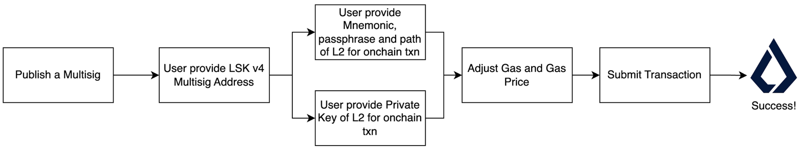

# Claim CLI

This library is a tool to claim Lisk tokens without the need for UI. This tool can provide the following services:

- Check Eligibility
- Submit a Claim
- Publish a Multisig claim with completed signatures onchain


## Run

```
# Navigate to claim-cli package
cd packages/claim-cli

# Install dependencies
yarn && yarn build

# Start Claim CLI on mainnet
./bin/run.js

# Or start Claim CLI on testnet
# ./bin/run.js --network testnet
```

## Usage

Detailed guide to Claim CLI is located in [Detailed Guide to Claim CLI Tool](../../documentation/Detailed_Claim_CLI.md).

## Workflow

### Check Eligibility


### Submit a Claim


### Publish a Multisig claim with completed signatures onchain


